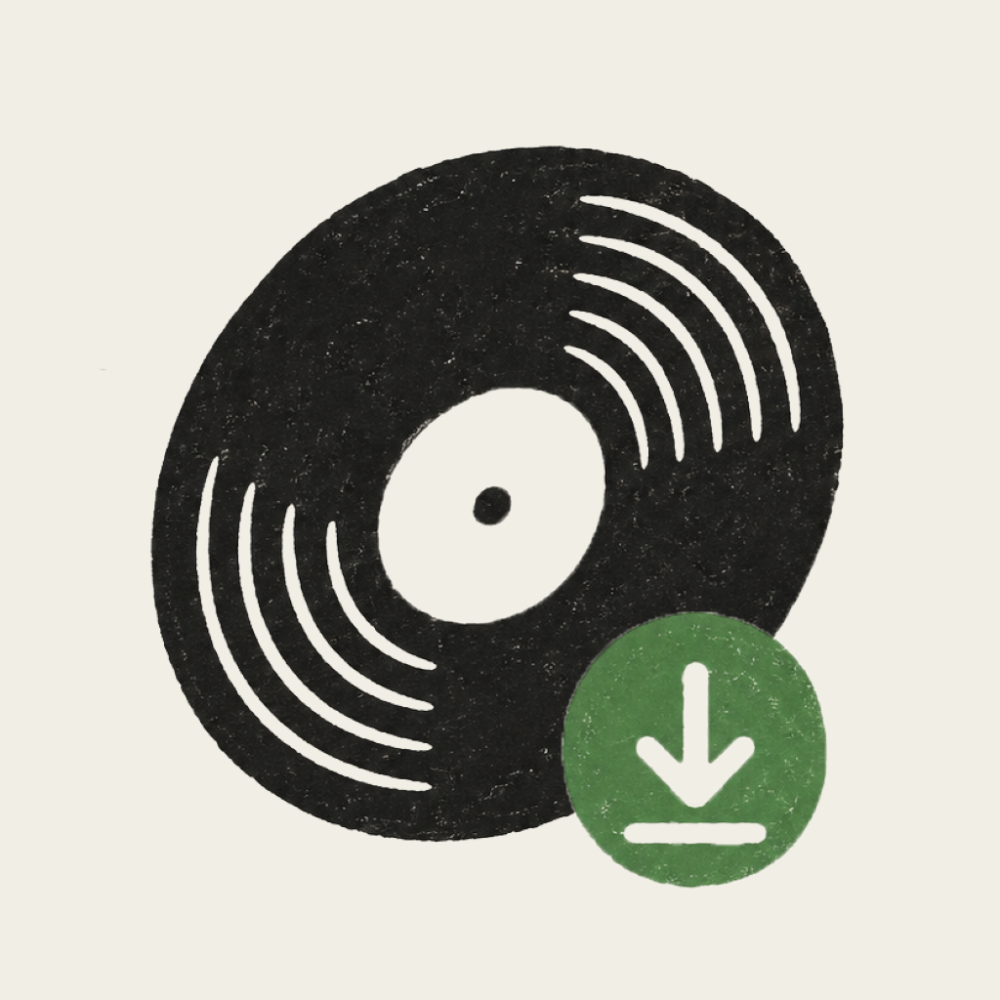

# MusicDL

<p align="center">
  
</p>

Bulk playlist downloader with a minimalist desktop GUI. Supports Spotify, SoundCloud, and YouTube. Downloads MP3 at 320 kbps.

---

## Features

- **Multi-platform** — Spotify playlists & tracks, SoundCloud sets & tracks, YouTube playlists & videos
- **Pipelined download** — resolve and download concurrently for maximum speed
- **Music Updater** — incremental sync: skip already-downloaded tracks on re-run
- **Single tracks** — non-playlist links go to a `SINGLES/` folder
- **Cancel anytime** — per-job cancel button in the GUI
- **Error display** — failed jobs show the error inline in the card
- **Logs** — full log written to `%APPDATA%\MusicDL\musicdl.log` on Windows

---

## Download

Grab the latest **MusicDL.exe** from the [Releases](../../releases/latest) page — no Python, no FFmpeg, no install required. Just run it.

---

## Run from source

### 1. Clone

```bash
git clone https://github.com/Vincent-0212/music-dl.git
cd music-dl
```

### 2. Install dependencies

```bash
pip install -r requirements.txt -r SpotdlRip/requirements.txt
```

> Requires **Python 3.12** and [FFmpeg](https://ffmpeg.org/download.html) on PATH.

### 3. Launch

```bash
python gui.py
```

---

## Spotify setup

Spotify credentials are entered directly in the app's Settings panel on first launch. No config file needed.

If you prefer to pre-configure:

1. Go to [Spotify Developer Dashboard](https://developer.spotify.com/dashboard)
2. Create an app — set the redirect URI to `http://127.0.0.1:8888/callback`
3. Copy your Client ID and Client Secret into `config.json`:

```json
{
  "spotify": {
    "client_id": "YOUR_SPOTIFY_CLIENT_ID",
    "client_secret": "YOUR_SPOTIFY_CLIENT_SECRET"
  },
  "output_dir": "C:/Users/YOU/Music",
  "audio_quality": "320",
  "music_updater": true
}
```

---

## Project structure

```
music-dl/
├── gui.py                  # PyWebView desktop app
├── config.json             # ← NOT in Git (add your own)
├── config.example.json     # Template
├── requirements.txt
├── musicdl.spec            # PyInstaller spec — Windows
├── musicdl-mac.spec        # PyInstaller spec — macOS
├── platforms/
│   ├── __init__.py         # Platform detection + dispatcher
│   ├── common.py           # Shared utilities, DownloadEvents
│   ├── spotify.py          # Spotify OAuth + pipeline
│   ├── soundcloud.py       # SoundCloud via yt-dlp
│   └── youtube.py          # YouTube via yt-dlp
├── SpotdlRip/
│   ├── spotdlrip.py        # Spotify → YouTube Music resolver
│   └── requirements.txt
└── frontend/
    ├── index.html
    ├── styles.css
    ├── app.js
    └── icon.png            # App icon
```

---

## License

MIT
